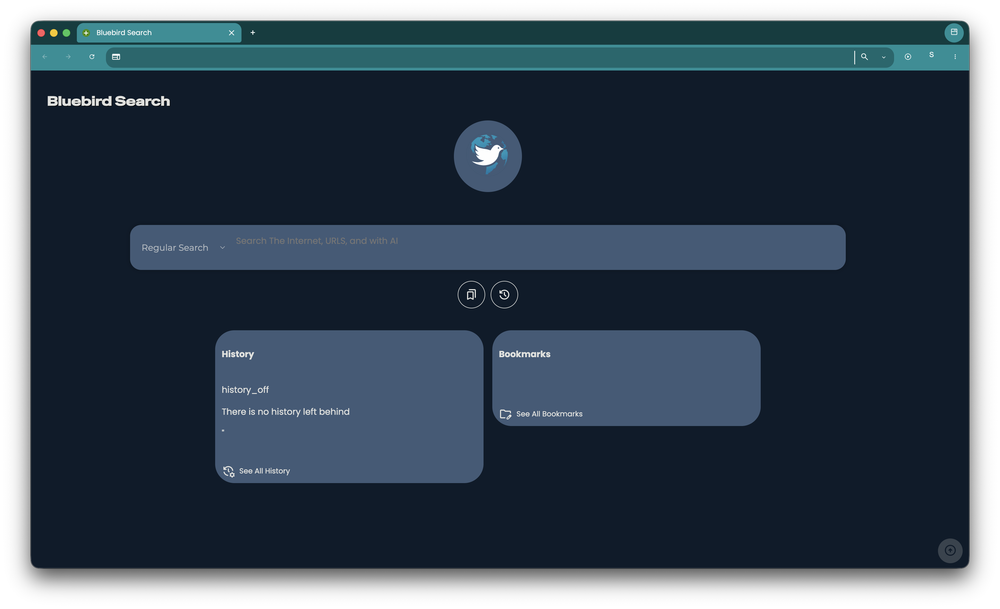

# Bluebird Browser

 <!-- Replace 'placeholder.png' with your actual image file -->

Bluebird Browser is a lightweight, privacy-focused web browser designed for speed and simplicity. Built with modern web technologies, it offers features like ad-blocking, tab management, and customizable themes to enhance your browsing experience. Perfect for developers and everyday users seeking an alternative to mainstream browsers.

### Features
- **Tab Management**: Easy-to-use interface for organizing multiple tabs. Click the top-right tabs button.
- **Customizable Themes**: Pick a color from the color picker from settings, then watch your browser transform.
- **A Modern Look**: To make it easy to use by everyone.

### Future Plans
- **Extension Support**: Plugin system for adding custom functionalities like password managers or productivity tools.
- **Enhanced Security**: Advanced features including phishing detection, HTTPS enforcement, and integrated VPN.
- **Mobile App Currently Planned**: iOS coming first, then Andriod. Will be built using [swift](https://swift.org).
- **AI-Powered Suggestions**: Smart search and content recommendations based on user behavior.
- **Performance Optimizations**: Further improvements in memory usage and battery life for extended sessions.
- **Ad Blocking**: Built-in blocker to reduce distractions and improve privacy.

## Installation

1. Clone the repository: `git clone https://github.com/yourusername/bluebird_browser.git`
2. Install dependencies: `npm install`
3. Run the browser: `npm start`

## Usage

- Launch the browser and start browsing.
- Access settings via the menu to customize themes and features.

## Contributing

We welcome contributions! Please fork the repo and submit a pull request.

## License

This project is not currently licensed.